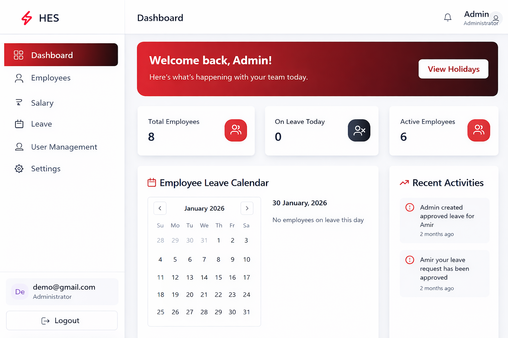
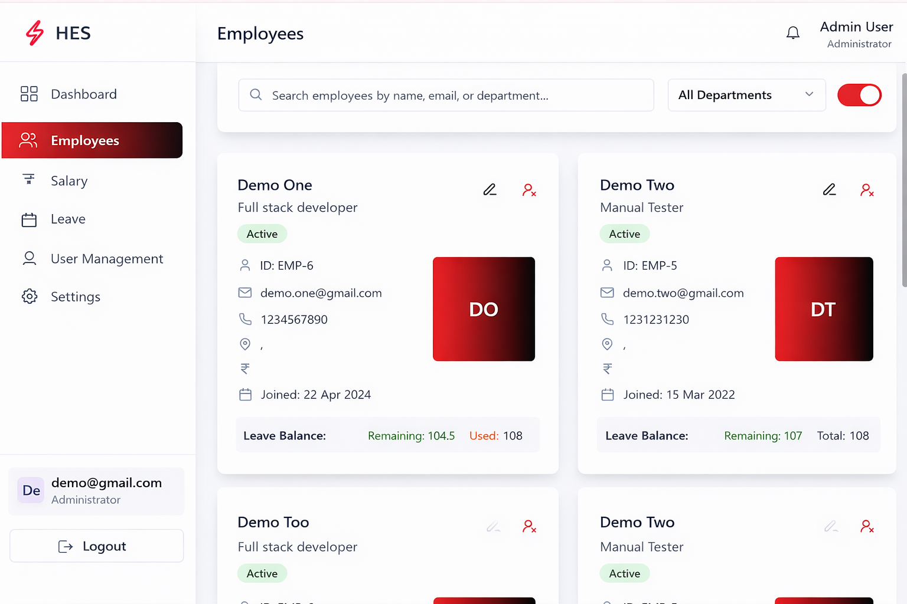
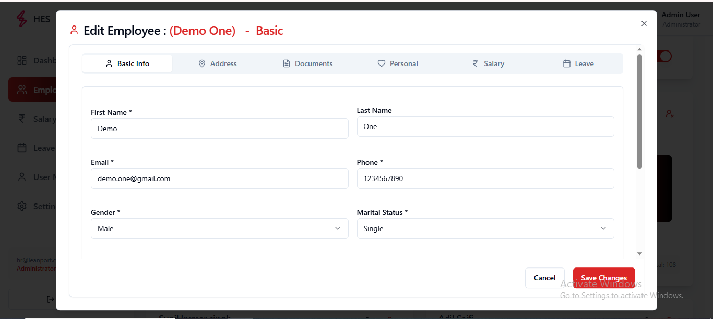
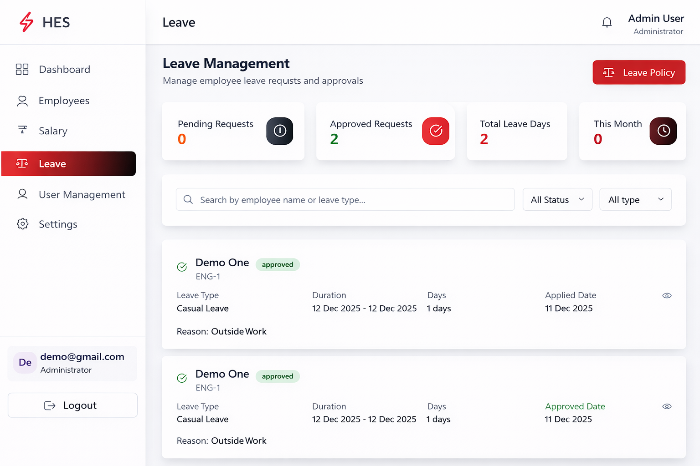
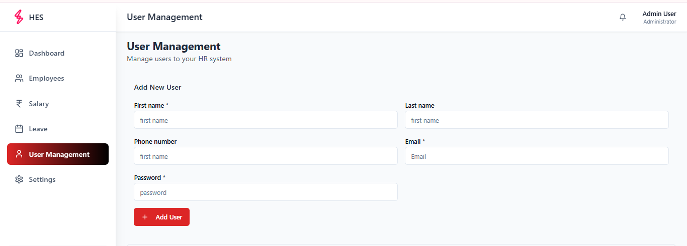
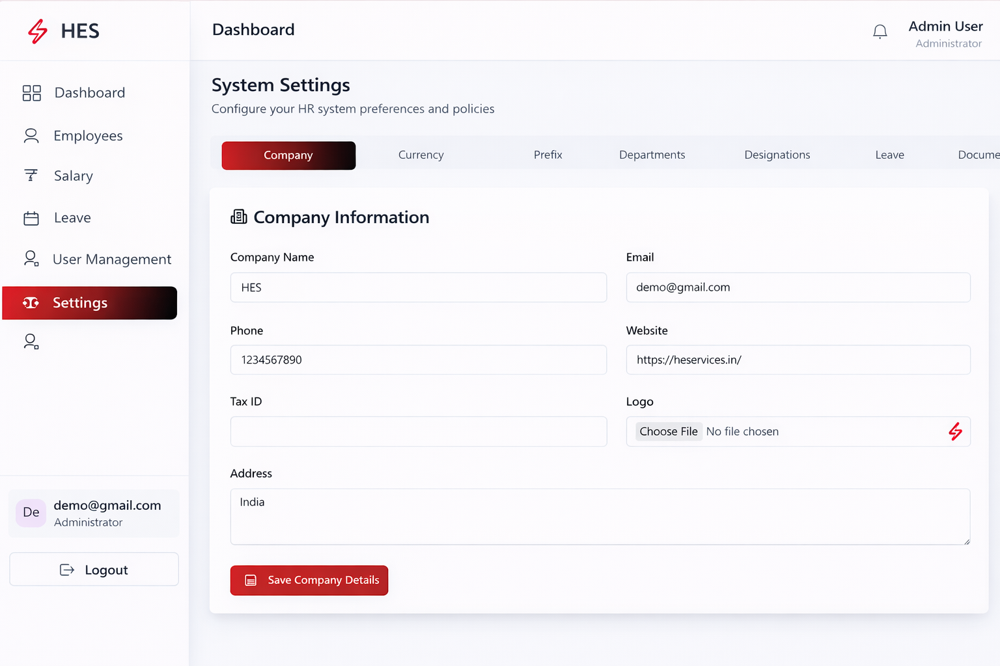

📝 Leave Application System

🔗 Live Demo: https://leave-application.vercel.app

📌 Core Features

     🔐 Authentication & Authorization
         -    Admin Login
         -    Employee Login
         -    Role-Based Access Control (RBAC)

     📝 Leave Management
         -    Apply for Leave (Employee)
         -    Approve / Reject Leave (Authorized User)
         -    Leave History Tracking
         -    Real-time Leave Status Updates

     📝💰 Salary Management
         -    Automatic Salary Generation on Last Day of Month
         -    Salary Calculation Based on Approved Leaves
         -    Monthly Salary Records Stored in Database
         -    Salary History View for Employees
         -    Salary generation is handled via a scheduled cron job in the backend.

     📊 Dashboard Overview
         -    Total Employees Count
         -    Leave Statistics (Pending / Approved / Rejected)
         -    Monthly Salary Summary

     🛠️ Tech Stack
         🟢 Backend
                  -    React.js
                  -    Node.js
                  -    Bootstrap
         🗄️ Database
                  -    MySQL
         🧰 Tools & Deployment
                  -    Docker
                  -    Git & GitHub
                  -    Vscode
                  -    Netlify

📸 Screenshots (See Below)

### 📊 Dashboard

### 👥 Employee List

### ✏️ Update Employee

### 📝 Apply Leave

### ➕ Create User

### 🏢 Company Details

🔒 Source Code: Private repository. Available upon request.
